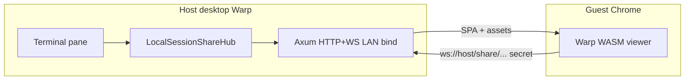
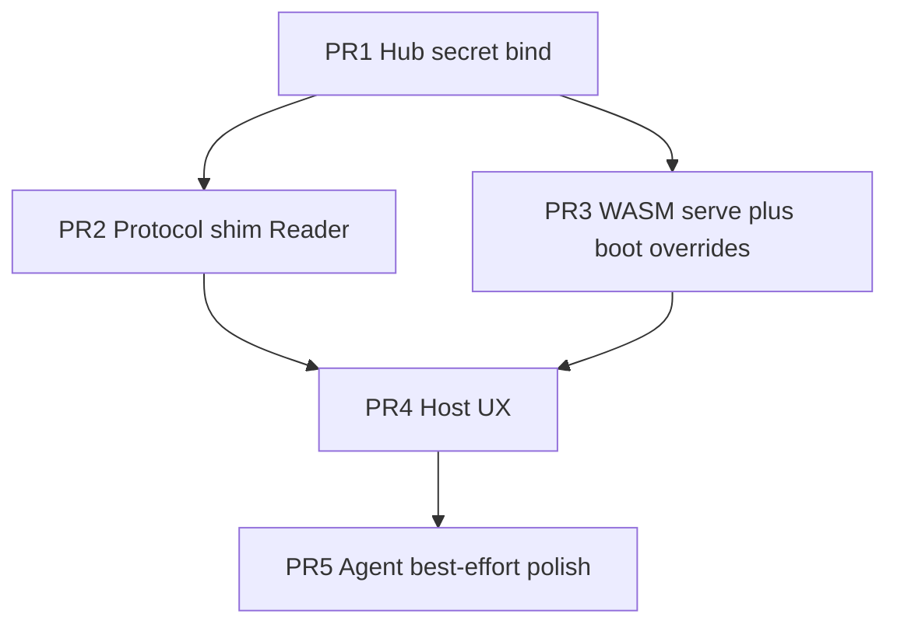

# Local LAN / Tailscale live session share — tech spec

Product spec: [PRODUCT.md](./PRODUCT.md) · Research pin: `c0343622`

Behavior invariants below are cited as **P\<n\>** from PRODUCT.md.

## Context

Cloud shared sessions already stream a live pane to Chrome via the full Warp WASM client at `{server_root}/session/{id}`, relayed through `wss://sessions.app.warp.dev`. PRODUCT wants the same **WASM fidelity** and **view-only** guest experience, but with a **host-local HTTP+WS** surface on a chosen LAN/Tailscale bind, gated by a **URL secret**, without Warp cloud as the realtime relay (P13–P15, P25–P26).

Current cloud path:

1. Desktop sharer opens WS `/sessions/create`, sends `Initialize` with scrollback (`app/src/terminal/shared_session/sharer/network.rs`).
2. Viewer (desktop or WASM) joins `/sessions/join/{session_id}` (`viewer/network.rs`), receives `JoinedSuccessfully` + boxed `Scrollback`, then ordered terminal events.
3. Human link: [`join_link` @ c0343622](https://github.com/warpdotdev/warp/blob/c03436229877df948aabfcabcfe385e07488dde2/app/src/terminal/shared_session/mod.rs#L340-L357) → `{server_root}/session/{uuid}`.
4. Relay base: [`connect_endpoint` @ c0343622](https://github.com/warpdotdev/warp/blob/c03436229877df948aabfcabcfe385e07488dde2/app/src/terminal/shared_session/mod.rs#L360-L371) + `ChannelState::session_sharing_server_url()`.
5. View-only: protocol `Role::Reader` → `InteractionState::Selectable`; host rejects execute-bound requests in [`terminal_view_adaptor.rs` ~1051–1339 @ c0343622](https://github.com/warpdotdev/warp/blob/c03436229877df948aabfcabcfe385e07488dde2/app/src/terminal/local_tty/terminal_view_adaptor.rs#L1051-L1339).

WASM serving today is **dev-only loopback** via [`crates/serve-wasm`](https://github.com/warpdotdev/warp/blob/c03436229877df948aabfcabcfe385e07488dde2/crates/serve-wasm/src/main.rs) (`127.0.0.1`, SPA routes `/` and `/session/{id}`, assets under `/assets/client/...`). Desktop’s [`crates/http_server`](https://github.com/warpdotdev/warp/blob/c03436229877df948aabfcabcfe385e07488dde2/crates/http_server/src/lib.rs) is also **loopback-only** (`127.0.0.1:9277+channel`) and must not be overloaded for LAN PTY exposure without a separate, explicitly gated server.

Hard blockers for PRODUCT as of this pin:

- [`WebIntent::try_from_url`](https://github.com/warpdotdev/warp/blob/c03436229877df948aabfcabcfe385e07488dde2/app/src/uri/web_intent_parser.rs#L24-L30) requires URL host == `ChannelState::server_root_url()` (`app.warp.dev`), so `http://100.x:port/...` will not parse as a session view intent.
- Viewer/sharer networking assumes cloud WS + Firebase/IAP headers.
- No LAN bind + URL-secret gate for session traffic.

Protocol dependency: workspace crate `session-sharing-protocol` (git). Prefer **reuse message shapes**; do not fork the crate for v1 unless a local-only auth field is unavoidable.

## Proposed changes

### Design choice

| Option | Verdict |
|---|---|
| A. Host-local axum hub + serve WASM bundle; reuse `session-sharing-protocol` + existing viewer event loop with a local transport | **Chosen** |
| B. Thin xterm.js viewer | Rejected by PRODUCT fidelity (Warp WASM) |
| C. Tunnel existing cloud share over Tailscale | Rejected — still depends on Warp cloud relay (P25) |
| D. Reuse `remote_server` | Wrong surface (SSH host services) |

### Module layout

1. **`app/src/terminal/local_session_share/`** (new) — lifecycle, secret, bind UX plumbing, registration of one active share per pane, axum router factory.
2. Optional later extract **`crates/local_session_share_server`** only if hub unit tests need to avoid WarpUI; start in-app.
3. **Do not** merge into `crates/http_server`’s loopback singleton; local share is a separate server instance with explicit start/stop tied to share lifetime (P10–P11).
4. Feature flag: `FeatureFlag::LocalLanSessionShare` in `crates/warp_features` (dogfood-first). Distinct from `CreatingSharedSessions` / `ViewingSharedSessions`.

### Local hub protocol

- Speak the same JSON dialect as cloud: viewer `Initialize` → `JoinedSuccessfully` (scrollback, window size, `Role::Reader`, synthetic participant ids) → `OrderedTerminalEvent` stream (`PtyBytesRead`, command start/finish, `Resize`; optionally `AgentResponseEvent` for P24 best-effort).
- **Auth:** validate URL secret on HTTP page load and on WS upgrade (header or first message). Reject wrong/revoked secrets with no scrollback (P17).
- **Roles:** always assign `Role::Reader`. Drop or no-op executor-bound upstream (`WriteToPty*`, `ExecuteCommand`, agent prompts that mutate). Keep host `terminal_view_adaptor` checks as defense in depth (P15).
- **Transport switch:** host sharer path fans events into the local hub instead of (or mutually exclusive with) cloud WS (P31: block starting local while cloud share active on same pane, and vice versa).
- Guest WASM must connect to `ws://<same-host>:<port>/...` derived from `window.location` (or injected boot config), **not** `sessions.app.warp.dev`. Prefer `http`+`ws` together to avoid mixed-content (P5, P25).

### WASM serve + boot

- Package or locate a channel-appropriate WASM bundle the desktop can serve (dogfood: reuse build artifact path; TECH follow-up may embed).
- Axum static routes mirror `serve-wasm`: SPA for share path, `/assets/client/wasm`, `/assets/client/static`.
- Share URL shape (implementation detail, must satisfy P5): e.g. `http://<addr>:<port>/local-session/<secret>` (path token preferred over query to reduce referrer leakage; P26).
- **Boot overrides required:**
  - Parse LAN origins as local-share intent (extend or bypass `WebIntent` host check for this mode).
  - `ContextFlag::set_shared_session_only()` (or equivalent) so login/Drive chrome is not required (P23).
  - Inject local hub WS base + secret (or cookie set by first HTML response after secret check).
  - Suppress IAP/Firebase requirements for the live stream.

### Host UX wiring

- Command Palette + share menu: Start local network share / Copy link / Stop / optional Rotate (P1, P4, P9–P12, P33).
- Bind address picker: list non-loopback IPv4/IPv6 (LAN + Tailscale); allow all-interfaces with warning (P6–P8, P28).
- Pane badge / banner while active (P4).
- Mutual exclusion with cloud share (P31).

### Agent UI (P24)

- Required: PTY/block live view.
- Best-effort: forward `AgentResponseEvent` / replay markers when `AgentSharedSessions` viewer path works without guest login. Attachment downloads that need `ServerApiProvider` may fail soft; do not block PTY.

### Secrets and lifecycle

- Generate high-entropy secret on start; rotate invalidates old (P12, P26).
- Stop / pane close / app quit: tear down axum server, drop WS clients, clear registration (P10–P11).
- Scrollback cap on join: document constant in code (reuse cloud scrollback serialization limits where possible) (P20).

## End-to-end flow

1. Host enables LocalLanSessionShare → Start share on pane → hub binds → copy URL.
2. Guest opens URL on LAN/Tailscale → host serves WASM SPA → secret validated → WASM boots local-share viewer mode → WS join → scrollback + live events.
3. Guest keystrokes do not reach host PTY (Reader-only).
4. Host Stop → WS close → subsequent URL loads failure page (P18).

## Testing and validation

Map to PRODUCT behaviors:

| PRODUCT | Verification |
|---|---|
| P1–P4, P33 | Unit/UI: share actions gated by flag; desktop-only create; one share per pane; palette actions exist |
| P5–P9 | Integration: bind chosen addr; copied URL matches listener; port-in-use / no-iface errors |
| P10–P12 | Integration: stop/rotate/close pane invalidates secret; old WS disconnected |
| P13–P18 | Manual + automated where possible: Chrome on second machine/Tailscale loads WASM; wrong secret → no content; after stop → ended state |
| P15 | Unit: hub rejects WriteToPty; adaptor still rejects Reader |
| P19–P22 | Manual: two guests; reconnect; resize follows host |
| P23–P25 | Manual: no Warp login; live stream without `sessions.app.warp.dev` (proxy/network log); list any residual CDN in PR notes |
| P26–P30 | Manual: warnings shown; full secret not in telemetry fixtures |
| P31 | Unit: cannot start local while cloud active on same pane |
| P24 | Manual: PTY always; agent chrome if available |
| P35–P37 | Manual: interface change / sleep; single-pane scope |

Automated focus:

- Hub: secret auth, Reader-only, scrollback serialize smoke, stop/rotate.
- `WebIntent` / boot config parsing for LAN URLs.
- Flag off → no routes / no UI.

Manual dogfood script (required before done):

1. Host on Tailscale IP, Start share, copy link.
2. Guest Chrome on another device on Tailscale opens link → sees live output.
3. Type on guest → host PTY unchanged.
4. Stop share → guest shows ended; link dead.
5. Confirm cloud share still works independently on another pane.

## Parallelization

Worth parallelizing after the hub skeleton lands:

| Agent / PR | Owns | Mode | Branch default |
|---|---|---|---|
| Hub | `local_session_share` server, secret, bind | local worktree | `feat/local-lan-share-hub` |
| Protocol | Sharer fan-out → hub; viewer local transport | local worktree | `feat/local-lan-share-protocol` |
| WASM boot | Static serve, WebIntent/boot overrides | local worktree | `feat/local-lan-share-wasm` |
| UX | Palette, banners, mutual exclusion, warnings | after hub API stable | `feat/local-lan-share-ux` |

Coordination: Hub lands first (API: start/stop/copy URL). Protocol and WASM can fan out against hub interfaces. UX last. Prefer stacked PRs into one integration branch `feat/local-lan-session-share`, not four independent merges to main.

If a single engineer implements: same PR order sequentially; skip parallel agents.

## Risks and mitigations

| Risk | Mitigation |
|---|---|
| WASM origin / `WebIntent` lock | Explicit local-share intent path; tests for LAN URLs |
| Mixed content if HTTPS page + `ws://` | Ship `http`+`ws` for v1; Tailscale Serve/HTTPS later |
| Accidental internet bind | UI warning on `0.0.0.0`; dogfood flag |
| Huge WASM first load | Cache-Control; document; optional pre-bundle in app resources |
| Secret in browser history | Path token; no third-party referrers; rotate control |
| Cloud code paths still hit Firebase | Shared-session-only boot; skip IAP on local transport |
| Dual-share confusion | Hard mutual exclusion (P31) |
| Agent attachments need cloud | Soft-fail; PTY remains (P24) |

## Follow-ups (post-v1)

- Guest **control** (Executor) with host approval (PRODUCT non-goal for v1).
- Warp login / ACL guests.
- Multi-pane / workspace share.
- HTTPS via Tailscale Serve.
- Embed WASM in app resources for offline host.
- Presence avatars / richer collab chrome.
- Formal DECISIONS.md only if implementation diverges from this TECH.
